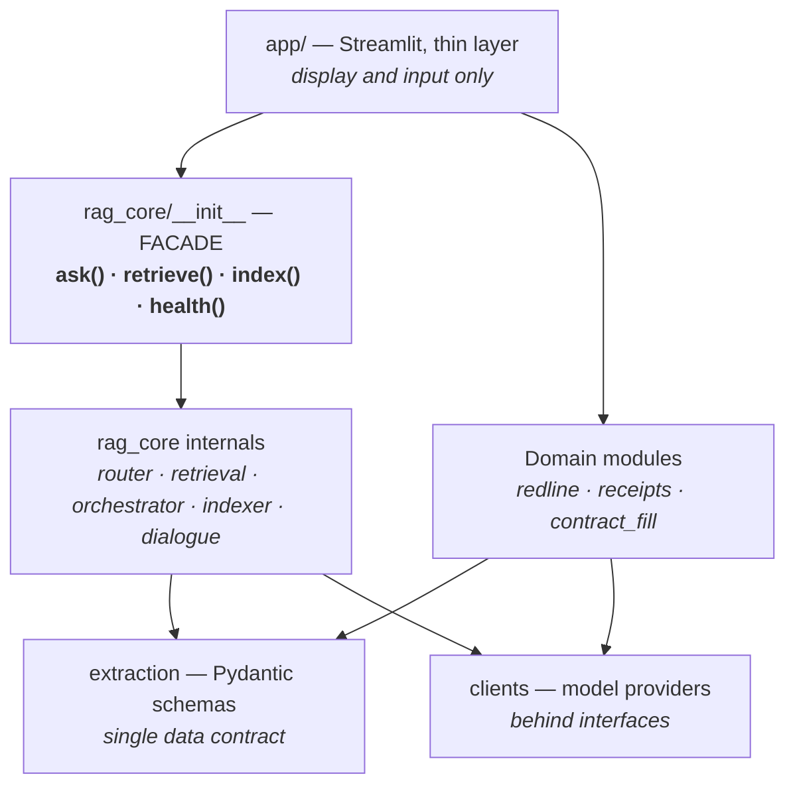
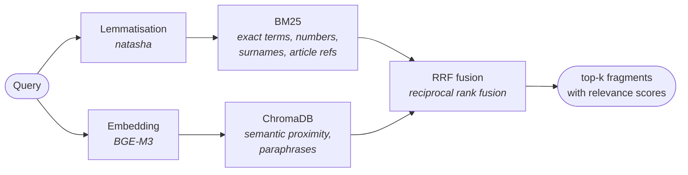
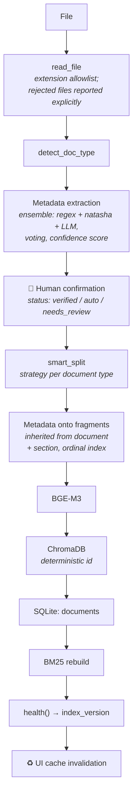
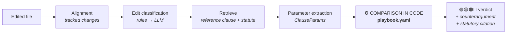

# LegalRent Copilot Architecture

The technical layer of the documentation. For the product overview and what each tab is for, see [README.en.md](README.en.md).

**Contents**
[Principle](#principle) · [Layers](#system-layers) · [Retrieval](#hybrid-retrieval) · [Router](#router) · [Indexing](#indexing-pipeline) · [Guard](#hallucination-defence) · [Memory](#conversational-memory) · [Review](#contract-review-pipeline) · [Tracing](#tracing) · [Boundaries](#boundaries-and-constraints) · [Tests](#test-pyramid) · [Evaluation](#evaluation-methodology) · [Rejections](#what-is-deliberately-not-used) · [Roadmap](#roadmap)

🇷🇺 [Читать на русском](ARCHITECTURE.md)

---

## Principle

> **The LLM extracts facts and phrases text. Deterministic code makes the judgments, following explicit rules.**

This is risk management, not a stylistic preference. In legal work the cost of an error isn't "an imprecise answer" — it's a wrong assessment of a contract term. So everything that constitutes a judgment has been moved out of the model and into code:

| Decision | Who makes it |
|---|---|
| Route the query to tables or to documents | Router rules |
| Whether an edit made the contract better or worse | Code against `playbook.yaml` |
| Whether the bill arithmetic adds up | Arithmetic verification |
| Whether a tax ID or bank code is valid | Checksum |
| Who "he" refers to in a follow-up question | Reference-resolution rules |
| How to phrase the answer | LLM |
| What facts a document contains | LLM (with subsequent validation) |

A side effect is explainability: every judgment the system makes traces back to a specific rule rather than to model weights.

---

## System layers



**Coupling rules:**

1. Exactly four names are exported from `rag_core`. Versioned internals (`route_rule_v10`, `_run_sql_v8`) are never exposed.
2. Data crosses boundaries as Pydantic schemas only. `ask()` returns an `Answer` structure, not a string.
3. Writes to the database and index go through `indexer` and `ledger` exclusively. There are no other doors.
4. Every module runs from the terminal independently of the UI.
5. Models sit behind provider interfaces.
6. No implicit state: the query is passed as an explicit parameter; globals and `globals()` checks are prohibited — a lesson from migrating out of a notebook.

> 📎 Facade signatures and Pydantic schemas (no implementation): [docs/api-signatures.md](docs/api-signatures.md).

---

## Hybrid retrieval

Lexical and vector search fail in different ways, which is why both are used.



**Why this combination.** BM25 is reliable where exact matching matters: "Art. 616", a surname, a contract number. Vector search covers the case where the user phrases things differently from the document: "penalty for late payment" against "interest for breach of rent payment deadlines." RRF merges the two rankings without weight tuning — more robust than a linear combination and it needs no per-corpus calibration.

**Retrieval recall @10 = 0.935** on the real corpus.

A reranker was tested and archived: the quality gain didn't justify the added latency at current corpus size.

---

## Router

Decides the answer's source before any model is involved. It returns a structure, not a string:

```python
RouteDecision(
    target="sql",              # sql | rag | both
    rule_name="kw_payments",   # which rule fired
    matched_on="paid",         # on what exactly
)
```

This makes routing debuggable: the interface shows not just "went to the tables" but why.

**Branches:**

| Branch | Source | Typical question |
|---|---|---|
| 🟦 `sql` | SQLite: payments, contracts | "Who hasn't paid for May?" |
| 🟩 `rag` | Documents via hybrid retrieval | "What's the late fee in the Petrosyan lease?" |
| 🟪 `both` | Both, with context stitching | "How much does Petrosyan pay and what does the lease say about indexation?" |

**Fallback.** If the SQL branch comes back empty, the query moves to documents. Both routes are recorded in the trace — `route_initial` and `route_final`. Fallback frequency is surfaced in the metrics tab: it's simultaneously router diagnostics and a genuine system characteristic.

Routing is verified against a golden dataset of 21 questions — **21/21**.

---

## Indexing pipeline

The only write path into the knowledge base.



**Key decisions:**

- **Deduplication by document hash** — `scan()` distinguishes new / changed / duplicate. The CLI supports `--dry-run` before `--apply`.
- **A changed document is reindexed in full.** Old fragments are removed and new ones regenerated from the document. The reason is concrete: incremental updates once left 387 fragments out of sync, with some chunks still carrying a stale tenant name.
- **Deterministic fragment identifiers** (`doc_id:chunk_index`) — reindexing doesn't multiply duplicates.
- **BM25 is rebuilt as the final step**, `index_version` changes, and the UI cache invalidates itself. This closes the classic "I uploaded a document but chat can't see it" bug.
- **Metadata is confirmed before indexing.** An ingestion error propagates into every future answer, so the tenant is human-confirmed and the confirmed value is protected from being overwritten by automation.

**Current corpus:** 401 documents · 2,299 fragments · statuses 267 verified / 108 auto / 26 needs_review.

---

## Hallucination defence

Implemented in layers rather than as a single filter.

**Layer 1 — architectural, the primary one.** No judgments are delegated to the model (see [Principle](#principle)). Fabricating a verdict on an edit or a payment amount is technically impossible: code computes them.

**Layer 2 — context quality.** A hallucination often means the model had nothing to quote. Hence hybrid retrieval, full reindexing, and index integrity verification as a routine test.

**Layer 3 — the detector.** Checks the answer for numbers and registry identifiers absent from the supplied context. The control case: asked about a blank form, the answer must not contain tax-ID-shaped numbers. The interface offers a "guard on / off" toggle to demonstrate the difference.

**Layer 4 — verifiability.** Expandable sources with relevance scores and a complete trace. A hallucination doesn't have to be fully prevented — it has to be detectable in seconds.

Both directions are covered by tests: the detector catches fabrication **and stays quiet on honest answers** — the second matters more, since an over-eager guard makes the system useless.

---

## Conversational memory

A short-lived entity context held in session state:

```python
{"tenant": "Petrosyan", "doc_id": "...", "turns_left": 4}
```

Reference resolution happens **before the router** and **without any model call**: "his", "that lease", or a query with no tenant named → substitution from context; a different person explicitly named → switch. The context lives roughly four turns.

Why not model-based query rewriting: it adds latency, introduces non-determinism and risks blurring retrieval. That option is held in reserve and will be enabled only if reference-resolution quality drops below 90%.

The context is visible to the user as a badge and cleared with a button — a wrong substitution is immediately apparent rather than failing silently.

---

## Contract review pipeline



`playbook.yaml` holds **9 edit categories and 2 red lines**, written by a practising lawyer. The file lives inside `src/redline/` rather than in configuration, deliberately: it is logic, not a setting. Every verdict carries the playbook version, so it's always possible to say which revision of the rules produced a given assessment.

An edit not described by the parametric model is flagged amber, "outside model" — the system does not pretend to have assessed it.

Edits are processed in parallel; the demonstration target is a first verdict in under 10 seconds.

---

## Tracing

Every request is recorded in SQLite:

| Field | Purpose |
|---|---|
| `trace_id` | links the answer to its trace |
| `route_initial` / `route_final` | original and final route (fallback becomes visible) |
| `rule_name`, `matched_on` | which rule fired and on what |
| fragments with scores | exactly what entered the context |
| extracted parameters | what the model read from the document |
| playbook rules | which rules produced the verdict |
| `playbook_version` | which revision of the rules applied |
| latency, model | performance and provider |

This serves simultaneously as a debugging tool, the raw material for metrics, and the basis for compliance reproducibility.

> 📎 An anonymised trace record example: [docs/trace-example.md](docs/trace-example.md).

---

## Boundaries and constraints

This section describes the actual state of affairs, including what isn't closed yet.

### Where each component runs

| Component | Today | Target |
|---|---|---|
| SQLite, ChromaDB, BM25, BGE-M3, natasha | 🖥 local | unchanged |
| Router, conversational memory, validators, review comparison | 🖥 local, no models | unchanged |
| Entity extraction from documents | 🖥 Qwen3 via Ollama | unchanged |
| Answer and verdict phrasing | 🇷🇺 GigaChat | + local mode |
| Passport recognition | 🌐 `claude-sonnet-4-6`, test samples | 🖥 local VLM |

### Why GigaChat

A deliberate choice on two criteria at once. **Jurisdiction:** processing stays within Russia, which is what handling tenants' personal data under 152-FZ requires. **Quality:** Russian legal phrasing proved sufficient in evaluation — the model handles contract-law terminology and the structure of statutory citations reliably.

The document corpus is never transmitted: only the text of a specific query with its retrieved context leaves the machine.

### Known constraints

Listed plainly, because claims about regulatory compliance depend on them:

1. **Passport recognition runs on a foreign API.** The target model is a local Qwen3-VL; the build tested so far doesn't clear the accuracy bar (test marked `xfail`) and selection of a local alternative continues. Until that is resolved, the feature is used **on test samples only**, never on real documents.
2. **A fully offline generation mode is not implemented.** Local generation is available for some paths; contract review in the current build requires a cloud provider. Bringing every path under a single provider switch is in progress.
3. **There is no automatic failover when an external API is unavailable.** A network or rate-limit failure surfaces a generation error rather than falling back to the local model. Failover is planned.
4. **The database de-identification script is missing.** Demonstration material is prepared manually; automating this is scheduled as the first step of public-release preparation.

These constraints were identified by an internal codebase audit; the report is in `docs/`.

---

## Test pyramid

**324 tests:** 241 unit · 62 integration · 21 e2e.

```
tests/
├── unit/          fast, no database or models, run in pre-commit
│   ├── test_chunking.py       document splitting
│   ├── test_extraction.py     metadata extraction, party roles
│   ├── test_validators.py     tax ID / registration / bank code checksums
│   ├── test_router.py         golden dataset: 21 questions
│   └── test_rrf.py            rank fusion
│
├── integration/   against a test database, no cloud models
│   ├── conftest.py            fixture: a mini corpus built by the indexer —
│   │                          the fixture itself exercises indexing
│   ├── test_retrieval.py      reference fragments appear in top-k
│   ├── test_sql_branch.py     sums, payments, empty results
│   ├── test_indexer.py        deduplication; health catches desync
│   └── test_guard.py          catches fabrication / stays quiet on honest answers
│
└── e2e/           full scenarios, local model
    ├── test_ask_pipeline.py       three branches, fallback, guard
    ├── test_document_lifecycle.py PRIMARY — full document round trip
    ├── test_receipts_flow.py
    ├── test_redline_flow.py
    └── test_dialogue.py
```

**The primary scenario — a full document round trip.** A new contract is placed in a temporary folder → `scan()` sees it as new → `apply()` → `health()` confirms integrity and a changed index version → a question about the document returns a value from it → the file is modified → the cycle repeats and returns the **new** value (no stale fragments survive) → reindexing the same file yields "duplicate."

One test exercises reading, extraction, splitting, metadata, vectorisation, deduplication, full reindexing, BM25 rebuild and retrieval availability at once. If it's green, the system is alive.

**Deliberately untested:** the quality of model phrasing (that's evaluation against a threshold, not a test), load behaviour (out of scope at this stage), UI clicking (the layer is thin and the logic beneath it is covered).

---

## Evaluation methodology

**The core of evaluation is real data only**, at least 30 examples per module, drawn from practice. Synthetic examples are not admitted into the headline metric: on legal text they fail to reproduce precisely what breaks the system — non-standard phrasing, misspelled surnames, unusual party roles. Where used, they live in a separate file and appear on a separate line of the report.

**Every measurement stores a fingerprint of the data** alongside the metrics. A before/after comparison is only honest on an identical corpus — without the fingerprint, an apparent improvement may just be a change in the data.

| Metric | Value |
|---|---|
| Retrieval recall @10 | 0.935 |
| Regression suite | 10/10 |
| Routing | 21/21 |
| Guard stress tests | ≥10/12 |

---

## What is deliberately not used

The test applied to every tool: **what specific problem does it solve, and can that be solved in 50 lines of Python?**

| Rejected | Reason |
|---|---|
| **LangGraph, CrewAI, Dify** | The task is dispatching three branches by rule. That's a ~50-line function. A framework would add abstraction, debugging complexity and a dependency, with no gain |
| **OCR stacks** (PaddleOCR, Docling, Surya) | Inputs are textual; the only image scenario is a passport, which is a single vision-model call |
| **Reranker** | Tested; the gain didn't justify the latency at current corpus size. Code kept in the archive |
| **Microservices** | One user, one process. Network boundaries would only add failure points |
| **Langfuse, MLflow** | In-house tracing to SQLite covers the need without dragging in infrastructure |
| **CSS hacks over Streamlit** | They break on framework updates. Native theming and a shared UI kit only |
| **Synthetic data in the headline metric** | Doesn't reproduce real failure modes on legal text |
| **Full dialogue history in the generation prompt** | More expensive, non-deterministic, and it blurs retrieval. Memory is implemented as entity context instead |

Rejecting a tool is as much an architectural decision as adopting one, and it's recorded on equal terms.

---

## Roadmap

| Area | State |
|---|---|
| RAG core: retrieval, router, SQL branch, indexer, health | ✅ |
| Conversational memory | ✅ |
| Registry number validators | ✅ |
| Contract review: 9-category playbook, verdict engine | ✅ |
| Utility bills: extraction → .docx → payment ledger | 🔨 |
| Contract filling: local VLM selection | 🔨 |
| Interface: chat, knowledge base, metrics | 🔨 |
| Failover to a local model on external API failure | 🔜 |
| Single provider switch across all paths | 🔜 |
| Database de-identification for demonstrations | 🔜 |
| Fully offline mode | 🔜 |

**Deliberately deferred:** a tenant-perspective playbook (the schema field exists) · parametric contract filling (the shared schema is ready) · model-based query rewriting (to be enabled if reference-resolution quality falls below 90%) · full payment reconciliation · diffing clean contract versions without tracked changes.

---

For the product overview and what each tab is for, see [README.en.md](README.en.md).
