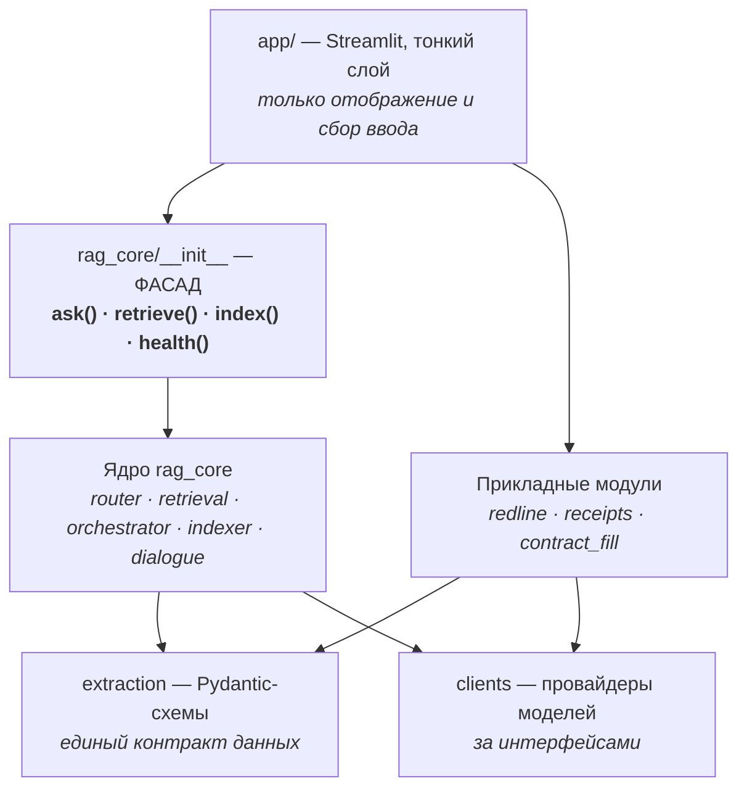
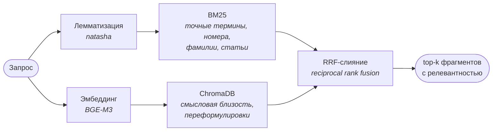
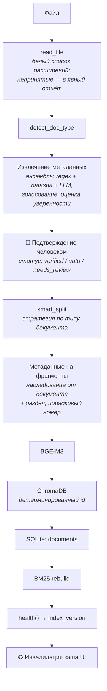
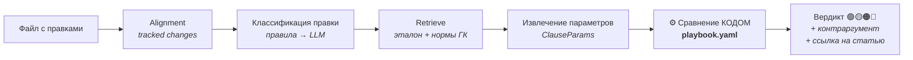

# Архитектура LegalRent Copilot

Технический слой документации. Продуктовое описание и назначение вкладок — в [README.md](README.md).

🇬🇧 [Read in English](ARCHITECTURE.en.md)

**Содержание**
[Принцип](#принцип) · [Слои](#слои-системы) · [Поиск](#гибридный-поиск) · [Роутер](#роутер) · [Индексация](#конвейер-индексации) · [Guard](#защита-от-галлюцинаций) · [Диалог](#диалоговая-память) · [Redline](#конвейер-оценки-правок) · [Трассировка](#трассировка) · [Контуры](#контуры-и-ограничения) · [Тесты](#пирамида-тестов) · [Оценка](#методика-оценки) · [Отказы](#что-осознанно-не-используется) · [Дорожная карта](#дорожная-карта)

---

## Принцип

> **LLM извлекает факты и формулирует текст. Суждения выносит детерминированный код по явным правилам.**

Это не стилистический выбор, а способ управления риском. В юридической задаче цена ошибки — не «неточный ответ», а неверная оценка условия договора. Поэтому всё, что является суждением, вынесено из модели в код:

| Решение | Кто принимает |
|---|---|
| Куда направить запрос — в таблицы или документы | Правила роутера |
| Лучше или хуже стала правка договора | Код по `playbook.yaml` |
| Сходится ли сумма в квитанции | Арифметическая проверка |
| Валиден ли ИНН/ОГРН/БИК | Контрольные цифры |
| О ком идёт речь в «у него» | Правила разрешения ссылок |
| Как сформулировать ответ | LLM |
| Какие факты содержатся в документе | LLM (с последующей валидацией) |

Побочный эффект — объяснимость: любое суждение системы прослеживается до конкретного правила, а не до весов модели.

---

## Слои системы



**Правила связи:**

1. Наружу из `rag_core` видны ровно четыре имени. Внутренние функции с версиями (`route_rule_v10`, `_run_sql_v8`) наружу не экспортируются.
2. Обмен данными — только Pydantic-схемами. `ask()` возвращает структуру `Answer`, не строку.
3. Запись в базу и индекс — только через `indexer` и `ledger`. Других дверей нет.
4. Каждый модуль запускается из терминала независимо от UI.
5. Модели — за интерфейсами провайдеров.
6. Никакого неявного состояния: запрос передаётся явным параметром, глобалы и `globals()`-проверки запрещены (урок реорганизации из ноутбука).

> 📎 Сигнатуры фасада и Pydantic-схемы (без реализации): [docs/api-signatures.md](docs/api-signatures.md).

---

## Гибридный поиск

Лексический и векторный поиск дают разные ошибки, поэтому используются вместе.



**Почему именно так.** BM25 надёжен там, где важно точное совпадение: «ст. 616», «Петросян», номер договора. Векторный поиск работает там, где пользователь формулирует иначе, чем написано в документе: «штраф за просрочку» против «пеня за нарушение сроков внесения арендной платы». RRF объединяет ранжирования без подбора весов — устойчивее линейной комбинации и не требует калибровки под каждый корпус.

**Полнота поиска R@10 = 0.935** на реальном корпусе.

Реранкер тестировался и вынесен в архив: прирост качества не оправдал добавленной латентности на текущих объёмах.

---

## Роутер

Определяет источник ответа до всякого обращения к модели. Возвращает не строку, а структуру:

```python
RouteDecision(
    target="sql",              # sql | rag | both
    rule_name="kw_payments",   # какое правило сработало
    matched_on="оплатил",      # на чём именно
)
```

Это делает маршрутизацию отлаживаемой: в интерфейсе видно не только «пошёл в таблицы», но и почему.

**Ветки:**

| Ветка | Источник | Типичный вопрос |
|---|---|---|
| 🟦 `sql` | SQLite: платежи, договоры | «Кто не оплатил за май?» |
| 🟩 `rag` | Документы через гибридный поиск | «Какая пеня в договоре с Петросяном?» |
| 🟪 `both` | Оба, со сшивкой контекста | «Сколько платит Петросян и что в договоре про индексацию?» |

**Fallback.** Если SQL-ветка вернула пусто, запрос уходит в документы. В трассировке фиксируются оба маршрута — `route_initial` и `route_final`. Частота fallback выводится в метриках: это одновременно диагностика роутера и рабочая характеристика системы.

Роутинг проверяется золотым датасетом на 21 вопрос — **21/21**.

---

## Конвейер индексации

Единственный путь записи в базу знаний.



**Ключевые решения:**

- **Дедупликация по хэшу документа** — `scan()` различает новый / изменённый / дубликат. CLI поддерживает `--dry-run` до `--apply`.
- **Изменённый документ переиндексируется целиком.** Старые фрагменты удаляются, новые генерируются заново от документа. Причина конкретна: точечное обновление однажды привело к рассинхрону метаданных на 387 фрагментах, когда часть чанков сохранила устаревшего арендатора.
- **Детерминированный идентификатор фрагмента** (`doc_id:chunk_index`) — повторная индексация не плодит дубликаты.
- **BM25 перестраивается последним шагом**, `index_version` меняется, кэш интерфейса инвалидируется сам. Это закрывает классический баг «загрузил документ, а чат его не видит».
- **Подтверждение метаданных до индексации.** Ошибка на входе размножается по всем будущим ответам, поэтому арендатор подтверждается человеком, а подтверждённое значение защищено от перезаписи автоматикой.

**Текущий корпус:** 401 документ · 2 299 фрагментов · статусы 267 verified / 108 auto / 26 needs_review.

---

## Защита от галлюцинаций

Реализована слоями, а не одним фильтром.

**Слой 1 — архитектурный, основной.** Модели не делегированы суждения (см. [Принцип](#принцип)). Выдумать оценку правки или сумму платежа технически невозможно: их считает код.

**Слой 2 — качество контекста.** Галлюцинация часто означает, что модели нечего было процитировать. Отсюда гибридный поиск, переиндексация целиком, проверка целостности индекса как регулярный тест.

**Слой 3 — детектор.** Проверяет ответ на числа и реквизиты, отсутствующие в переданном контексте. Контрольный сценарий: на вопрос по пустому бланку в ответе не должно появиться ИНН-подобных чисел. В интерфейсе — переключатель «с guard / без» для демонстрации разницы.

**Слой 4 — проверяемость.** Раскрываемые источники с релевантностью и полная трассировка. Галлюцинацию не обязательно предотвратить полностью — достаточно сделать её обнаруживаемой за секунды.

Тестами покрыты оба направления: детектор ловит выдумку **и не срабатывает на честном ответе** — второе важнее, поскольку слишком чувствительный guard делает систему бесполезной.

---

## Диалоговая память

Краткосрочный контекст сущностей в состоянии сессии:

```python
{"tenant": "Петросян", "doc_id": "...", "turns_left": 4}
```

Разрешение ссылок происходит **до роутера** и **без обращения к модели**: «у него», «этот договор», запрос без явно названного арендатора → подстановка из контекста; явно названо другое лицо → переключение. Время жизни — около четырёх реплик.

Почему не переформулировка запроса моделью: это дополнительная латентность, недетерминированность и риск размыть поиск. Такой вариант остаётся в резерве и будет включён, только если оценка качества разрешения ссылок опустится ниже 90%.

Контекст виден пользователю бейджем и сбрасывается кнопкой — ошибка подстановки заметна сразу, а не проявляется молча.

---

## Конвейер оценки правок



`playbook.yaml` — **9 категорий правок и 2 красные линии**, написанные практикующим юристом. Файл лежит внутри `src/redline/`, а не в конфигурации, намеренно: это часть логики, а не настройка. Каждый вердикт несёт версию playbook, что позволяет сказать, по какой редакции правил получена оценка.

Правка, не описанная параметрической модели, помечается жёлтым «вне модели» — система не делает вид, что оценила её.

Правки обрабатываются параллельно; целевая характеристика демонстрации — первый вердикт быстрее 10 секунд.

---

## Трассировка

Каждое обращение фиксируется в SQLite:

| Поле | Назначение |
|---|---|
| `trace_id` | связывает ответ со следом |
| `route_initial` / `route_final` | исходный и итоговый маршрут (виден fallback) |
| `rule_name`, `matched_on` | какое правило сработало и на чём |
| фрагменты с релевантностью | что именно попало в контекст |
| извлечённые параметры | что модель прочитала из документа |
| правила playbook | какие правила применены в вердикте |
| `playbook_version` | по какой редакции правил вынесена оценка |
| латентность, модель | производительность и провайдер |

Это одновременно инструмент отладки, материал для метрик и основа воспроизводимости для комплаенса.

> 📎 Пример обезличенной записи трассировки: [docs/trace-example.md](docs/trace-example.md).

---

## Контуры и ограничения

Раздел описывает фактическое положение дел, включая незакрытые места.

### Что где выполняется

| Компонент | Сейчас | Целевое |
|---|---|---|
| SQLite, ChromaDB, BM25, BGE-M3, natasha | 🖥 локально | без изменений |
| Роутер, диалоговая память, валидаторы, сравнение redline | 🖥 локально, без моделей | без изменений |
| Извлечение сущностей из документов | 🖥 Qwen3 через Ollama | без изменений |
| Генерация ответов и формулировок | 🇷🇺 GigaChat | + локальный режим |
| Распознавание паспорта | 🌐 `claude-sonnet-4-6`, тестовые образцы | 🖥 локальный VLM |

### Почему GigaChat

Выбор осознанный, по двум критериям одновременно. **Юрисдикция:** обработка остаётся в контуре РФ, что критично при работе с персональными данными арендаторов (152-ФЗ). **Качество:** формулировки на русском юридическом языке оказались достаточными по результатам оценки — модель уверенно работает с терминологией договорного права и структурой ссылок на нормы.

Корпус документов при этом никуда не передаётся: наружу уходит только текст конкретного запроса с найденным контекстом.

### Известные ограничения

Перечислены прямо, поскольку от них зависят заявления о соответствии требованиям:

1. **Распознавание паспорта выполняется зарубежным API.** Целевая модель — локальный Qwen3-VL; протестированная сборка не проходит порог качества (тест помечен `xfail`), подбор локальной альтернативы продолжается. До закрытия вопроса функция используется **только на тестовых образцах**, не на реальных документах.
2. **Полностью офлайн-режим генерации не реализован.** Локальная генерация доступна для части сценариев; оценка правок в текущей сборке требует облачного провайдера. Приведение всех путей к единому переключателю провайдера — в работе.
3. **Автоматический откат при отказе внешнего API отсутствует.** Сбой сети или лимитов даёт ошибку генерации, а не переход на локальную модель. Реализация отката запланирована.
4. **Скрипт обезличивания базы отсутствует.** Демонстрационные материалы готовятся вручную; автоматизация запланирована первым шагом этапа публичной подготовки.

Ограничения выявлены внутренним аудитом кодовой базы; отчёт — в `docs/`.

---

## Пирамида тестов

**324 теста:** 241 unit · 62 integration · 21 e2e.

```
tests/
├── unit/          быстрые, без базы и моделей, в pre-commit
│   ├── test_chunking.py       разбиение документов
│   ├── test_extraction.py     извлечение метаданных, роли сторон
│   ├── test_validators.py     контрольные цифры ИНН/ОГРН/БИК
│   ├── test_router.py         золотой датасет: 21 вопрос
│   └── test_rrf.py            слияние ранжирований
│
├── integration/   на тестовой базе, без облачных моделей
│   ├── conftest.py            фикстура: мини-корпус, собираемый
│   │                          индексатором — сама фикстура его тестирует
│   ├── test_retrieval.py      эталонные фрагменты в top-k
│   ├── test_sql_branch.py     суммы, платежи, пустой результат
│   ├── test_indexer.py        дедупликация; health ловит рассинхрон
│   └── test_guard.py          ловит выдумку / не тревожит на честном
│
└── e2e/           полные сценарии, локальная модель
    ├── test_ask_pipeline.py       три ветки, fallback, guard
    ├── test_document_lifecycle.py ГЛАВНЫЙ — полный круг документа
    ├── test_receipts_flow.py
    ├── test_redline_flow.py
    └── test_dialogue.py
```

**Главный сценарий — полный круг документа.** Новый договор кладётся во временную папку → `scan()` видит «новый» → `apply()` → `health()` подтверждает целостность и смену версии индекса → вопрос по документу возвращает значение из него → файл изменяется → повторный цикл возвращает **новое** значение (старые фрагменты не остались) → повторная индексация того же файла даёт «дубликат».

Один тест проверяет разом: чтение, извлечение, разбиение, метаданные, векторизацию, дедупликацию, переиндексацию целиком, перестроение BM25 и доступность в поиске. Если он зелёный — система жива.

**Что не тестируется намеренно:** качество формулировок модели (это оценка с порогом, а не тест), нагрузка (не задача текущего этапа), клики в интерфейсе (слой тонкий, логика покрыта ниже).

---

## Методика оценки

**Ядро оценки — только реальные данные** из практики, не менее 30 примеров на модуль. Синтетические примеры в основную метрику не допускаются: на юридических текстах они плохо воспроизводят именно то, что ломает систему — нестандартные формулировки, опечатки в фамилиях, необычные роли сторон. При использовании они хранятся отдельным файлом и выводятся отдельной строкой отчёта.

**Каждый замер сохраняет отпечаток данных** рядом с метриками. Сравнение «до и после» честно только на идентичном корпусе — без отпечатка улучшение метрики может оказаться просто изменением данных.

| Метрика | Значение |
|---|---|
| Полнота поиска R@10 | 0.935 |
| Регрессионный набор | 10/10 |
| Роутинг | 21/21 |
| Стресс-тесты guard'а | ≥10/12 |

---

## Что осознанно не используется

Проверочный вопрос к каждому инструменту: **какую конкретную проблему он решает и решается ли она 50 строками Python?**

| Отклонено | Причина |
|---|---|
| **LangGraph, CrewAI, Dify** | Задача — диспетчеризация трёх веток по правилам. Это функция на ~50 строк. Фреймворк добавил бы абстракции, отладочную сложность и зависимость без выигрыша |
| **OCR-стек** (PaddleOCR, Docling, Surya) | Входы текстовые; единственный графический сценарий — паспорт, а это один вызов зрительной модели |
| **Реранкер** | Протестирован, прирост не оправдал латентности на текущих объёмах. Код сохранён в архиве |
| **Микросервисы** | Один пользователь, один процесс. Сетевые границы дали бы только новые точки отказа |
| **Langfuse, MLflow** | Собственная трассировка в SQLite покрывает потребность и не тянет инфраструктуру |
| **CSS-хаки поверх Streamlit** | Ломаются при обновлениях фреймворка. Только нативная тема и единый UI-kit |
| **Синтетика в основной метрике** | Не воспроизводит реальные отказы на юридических текстах |
| **История диалога целиком в промпт** | Дороже, недетерминировано, размывает поиск. Память реализована контекстом сущностей |

Отказ от инструмента здесь — такое же архитектурное решение, как его выбор, и фиксируется наравне с ним.

---

## Дорожная карта

| Направление | Состояние |
|---|---|
| Ядро RAG: поиск, роутер, SQL-ветка, indexer, health | ✅ |
| Диалоговая память | ✅ |
| Валидаторы реквизитов | ✅ |
| Redline: playbook на 9 категорий, ядро вердикта | ✅ |
| Квитанции: извлечение → docx → журнал платежей | 🔨 |
| Заполнение договора: подбор локального VLM | 🔨 |
| Интерфейс: чат, база знаний, метрики | 🔨 |
| Откат на локальную модель при отказе внешнего API | 🔜 |
| Единый переключатель провайдера на всех путях | 🔜 |
| Обезличивание базы для демонстраций | 🔜 |
| Полностью офлайн-режим | 🔜 |

**Отложено намеренно:** playbook с позиции арендатора (поле в схеме заложено) · параметрическое заполнение договоров (общая схема готова) · переформулировка запросов моделью (включится при падении качества разрешения ссылок ниже 90%) · полная сверка платежей · разбор чистых версий договоров без tracked changes.

---

Продуктовое описание и назначение вкладок — [README.md](README.md) · 🇬🇧 [English version](ARCHITECTURE.en.md)
