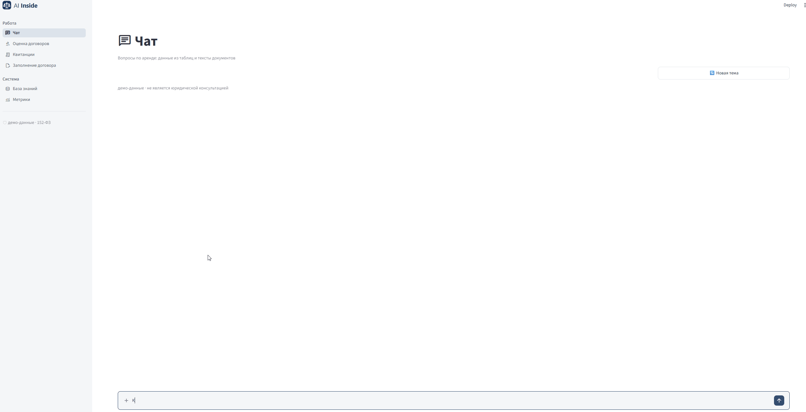
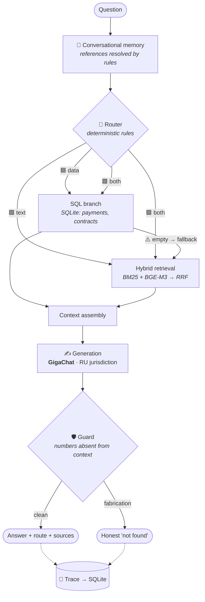

<div align="center">

# ⚖️ LegalRent Copilot

**An AI platform for the legal side of rental management, built on a purpose-built hybrid RAG: chat across contracts and payments, redline review with citations to the Russian Civil Code, utility bill calculation, and contract filling from a passport photo.**

*Hybrid retrieval across the contract corpus — lexical and vector, with rank fusion. Deterministic code makes the judgments, following explicit rules; the LLM extracts facts and phrases text. Every answer can be verified in 15 seconds.*


-21A038)


[What it does](#-what-it-does) · [Features](#-six-tabs--six-landlord-jobs) · [How it works](#-how-it-works-inside) · [Data & compliance](#-data-and-regulatory-compliance) · [Metrics](#-metrics) · [Quick start](#-quick-start)

🇷🇺 [Читать на русском](README.md)

<br>

<!-- ▶ GIF #1 — MAIN. Full cycle in 60s:
     upload a contract in "Knowledge Base" → confirm metadata → index
     → switch to "Chat" → ask about that document → answer with route badge
     → expand sources. Width 720px, no audio, 15–20 fps. -->
<!--  -->

<sub>Full cycle: new contract → indexing → question → answer with sources</sub>

</div>

---

## 🎯 What it does

Rental management is the same repeating loop of manual work. This platform closes it end to end.

| Landlord's job | The usual way | With LegalRent Copilot |
|---|---|---|
| "What's the late fee in the Petrosyan lease?" | Find the file, scroll 40 pages | Ask in chat → answer in seconds **with the source excerpt** |
| "Who hasn't paid for May?" | Reconcile messages, spreadsheets and memory | One question → answer from the payment ledger |
| Counterparty sends redlines | 30–40 minutes of review, easy to miss a swap | 🟢🟡🟠🔴 verdict per edit **with a Civil Code citation** |
| Utility bills from meter readings | Calculate by hand or in a spreadsheet → retype into Word → hope it matches | Three numbers per tenant → every bill for the month in one .docx |
| New tenant agreement | Retyping passport data, typos in tax IDs | Passport photo → filled contract, **registry numbers checksum-verified** |

> **How this differs from "a chatbot over documents."** You don't have to trust the answer — you can check it. Every answer carries its routing decision, the rule that fired, the retrieved fragments with relevance scores, and the version of the rules applied. For legal work that beats any promise that "the model doesn't make things up."

---

## 🗂 Six tabs — six landlord jobs

<div align="center">

<!-- ▶ GIF #2 — interface tour. Slow pass over the sidebar,
     ~1.5s pause on each tab. Width 640px. -->
 

</div>

| Tab | Job | Key design decision |
|---|---|---|
| 💬 **Chat** | Questions about contracts and payments | A rule-based router picks the source: tables, documents, or both |
| ⚖️ **Contract Review** | Checking counterparty redlines | The verdict comes from **code following a playbook**, not from a model |
| 🧾 **Utility Bills** | Calculating and issuing utility charges | Money is computed by **code alone** — no LLM involved |
| 📄 **Contract Filling** | Contract from a details card and passport photo | Registry numbers validated by checksum |
| 🗄️ **Knowledge Base** | Growing the corpus | A human confirms metadata **before** indexing |
| 📈 **Metrics** | Evidence of quality | Evaluation on real data, index health, routing distribution |

> **All of this runs on top of a single engine: RAG and hybrid search across a wide range of documents. The lexical branch finds exact matches—last name, article number, contract number; the vector branch understands rephrasing, when you ask for "late payment penalty" and the document says "late rent penalty." The results are combined into a single ranking. Each response contains the solution path, the rule that triggered, the fragments found with relevance, and the version of the evaluation rules. For legal work, this is more reliable than any promise that the "model is infallible."**

---

### 💬 Chat — one window into everything

**Why.** A single interface instead of "search the folder" plus "check the spreadsheet." The system determines on its own whether a question is about structured data or about document text.

**What it looks like:**

- **Thinking out loud** — a step feed in plain language: *"📊 This is a data question — going to the tables,"* with the technical detail below in grey: which rule fired, at what relevance.
- **Fallback shown as a story, not silence:** *"📊 checking tables → ⚠️ empty → 📄 found it in the acceptance certificate."* The system doesn't give up on the first empty branch — and it shows its work.
- **Route badge** on every answer: `🟦 SQL · 1.2s · GigaChat`.
- **Sources** expand on demand; for combined answers, split into "From tables" / "From documents."
- **Conversational memory.** *"What's Petrosyan's late fee?" → "And his lease term?"* — context persists, a "context: Petrosyan" badge stays visible, and a "🔄 New topic" button clears it. Reference resolution runs **on rules, with no model call**.

<!-- ▶ GIF #3 — chat. Sequence: payments question (SQL branch) → contract question
     (RAG branch with sources expanded) → follow-up "and his?" showing the
     context badge. Must capture the reasoning feed. Width 720px. -->


---

### ⚖️ Contract Review — the flagship

**Why.** Counterparty redlines are the highest-risk moment in a lease relationship. Flipping "capital repairs are the landlord's responsibility" (Art. 616 of the Russian Civil Code) or cutting a late fee from 0.1% to 0.01% is easy to miss by eye on page ten.

**How.** A pipeline where the judgment is made by code:

```
edited file → alignment (tracked changes) → edit classification
→ retrieve reference clause + statutory norms → parameter extraction
→ COMPARISON IN CODE against playbook.yaml → 🟢🟡🟠🔴 verdict + counterargument + citation
```

- **`playbook.yaml` — 9 edit categories and 2 red lines**, written by a practising lawyer. Not generated, not borrowed.
- Every verdict carries the playbook version, so it's always clear which revision of the rules produced it.
- An edit outside the parametric model gets an honest amber "outside model" — **not silence**.
- 📎 [Sample playbook fragment (2 of 9 categories)](docs/playbook-sample.yaml) — the rule format: thresholds, verdicts, Civil Code citations.

<!-- ▶ GIF #4 — redline. Upload an edited contract → verdicts appear with colour
     markers → expand one 🔴 showing the counterargument and Art. 616 citation.
     The strongest selling shot after the main demo. -->


---

### 🧾 Utility Bills — the most frequent chore

**Why.** The same loop repeats every month for every tenant: meter readings → calculation → bill. This module removes the manual arithmetic and the drift between "what I worked out in a spreadsheet" and "what went into the Word file."

**How.** Three numbers are entered per tenant: electricity (kWh), water (m³) and the heating charge as a finished figure. Above them sit the month, year and tariffs (₽/kWh, ₽/m³); the fixed part — payer, unit, floor area, standing shared costs — is stored separately.

All arithmetic runs through deterministic code in a single place:

```
electricity = round(kWh × tariff)      610 × 13.8 = 8,418 ₽
water       = round(m³ × tariff)         3 × 62   =   186 ₽
heating     = carried over as given                  1,200 ₽
shared      = fixed component                          715 ₽
                                       ─────────────────────
                                       Total       10,519 ₽
```

The on-screen preview and the document generator call the same calculation function, so the figures match by construction rather than by coincidence. The output is a single .docx containing every bill for the month.


> **No LLM is involved at any step of this module.** Computing money is entrusted to code alone: the result is reproducible, verifiable and independent of model temperature.

---

### 📄 Contract Filling — a photo instead of retyping

**Why.** Passport data and company registry numbers are the main source of typos in contracts.

**How.** A details card (.docx) plus a passport photo → one vision-model call → contract fields. Then deterministic protection: **tax ID, registration number and bank code are checksum-verified** — a plausible but invalid number won't pass. The finished contract lands in the indexer folder and **returns to the knowledge base**: you can query it in chat immediately.


> **On the vision model — stated plainly.** The target architecture is a local **Qwen3-VL**, so passport images never leave the machine. Model selection is in progress: the build tested so far doesn't clear the accuracy bar (the test is marked `xfail`). Until that's resolved, the recognition path runs on `claude-sonnet-4-6` — **on test samples only, never on real passports**. Details in [Data and regulatory compliance](#-data-and-regulatory-compliance).

---

### 🗄️ Knowledge Base — the only door into the index

**Why.** A metadata error at ingestion propagates into every future answer. So writes happen here and only through human confirmation.

**How.** Upload files → `scan()` by content hash: **new / changed / duplicate** → preview table → edit metadata **before** indexing (low confidence highlighted; document status recorded as `verified` / `auto` / `needs_review`) → indexing with progress → integrity check → "✓ 3 documents, 47 chunks."

A changed document is **reindexed in full** — chunks never live a separate life from their document. Unsupported formats don't disappear quietly: *"3 .doc files — please convert."*

<!-- ▶ GIF #5 — knowledge base. Upload several files → new/changed/duplicate table
     → edit tenant in the metadata editor → indexing with progress → result toast. -->
<!--  -->

---

### 📈 Metrics — the tab that answers "prove it"

Per-module evaluation results (real examples kept strictly separate from synthetic ones), index health, routing distribution and fallback frequency — a metric like *"12% of queries rescued by fallback logic."*

---

## 🧠 How the Hybrid RAG Works



### The architectural signature

> **The LLM extracts facts and phrases text. Deterministic code makes the judgments, following explicit rules.**

| Where | The LLM does | The code does |
|---|---|---|
| Contract review | extracts parameters, phrases the text | **compares against the playbook and issues the verdict** |
| Utility bills | reads meter values | **recomputes the arithmetic** |
| Contract filling | reads the passport | **validates registry numbers by checksum** |
| Routing | — | **rules** |
| Conversational memory | — | **reference-resolution rules** |

The model cannot invent a verdict on an edit or a payment amount — those decisions were never delegated to it. The same property makes the system explainable: every judgment traces back to a specific rule rather than to model weights.

📖 **Full internals** — hybrid retrieval and RRF, the router, the indexing pipeline, the tracing schema, the test pyramid, and the reasoning behind rejecting LangGraph and OCR: **[ARCHITECTURE.en.md](ARCHITECTURE.en.md)**

---

## 🔒 Data and regulatory compliance

The platform handles tenants' personal data and sensitive contract terms under Russian Federal Law 152-FZ (personal data protection), which sets data-residency expectations comparable to GDPR. Two principles follow.

**First: storage and retrieval are fully local, without exception.** The document store (SQLite), vector index (ChromaDB), lexical index (BM25) and embedding model (BGE-M3) all run on your machine. The corpus itself is never transmitted — only the text of a specific query with its retrieved context leaves the machine, and only at the answer-phrasing step.

**Second: GigaChat is a deliberate choice, not a compromise.** Answer generation runs through GigaChat (Sber) for two reasons at once: processing stays within Russian jurisdiction, which is what 152-FZ requires, and the quality of Russian legal phrasing proved sufficient in evaluation. Foreign APIs are not used for production work on real data.

### Current state of the boundaries — no varnish

| Component | Where it runs today | Target state |
|---|---|---|
| Storage, index, embeddings, retrieval | 🖥 **Local** | unchanged |
| Routing, conversational memory, validators, review verdicts | 🖥 **Local** (code, no models) | unchanged |
| Entity extraction from documents | 🖥 Local (Qwen3) | unchanged |
| Answer and verdict phrasing | 🇷🇺 **GigaChat, RU jurisdiction** | + fully local generation mode |
| Passport recognition (VLM) | 🌐 `claude-sonnet-4-6`, **test samples only** | 🖥 local VLM, selection in progress |

**What this means in practice.** The core — retrieval, routing, every deterministic judgment, the entire document corpus — is already local. Generation stays within Russian jurisdiction. The single component outside that boundary, passport recognition, is **not applied to real documents**: it runs on test samples while a local model of sufficient accuracy is being selected. A fully offline mode is a stated architectural goal, not the current state; the constraints are listed in [ARCHITECTURE.en.md](ARCHITECTURE.en.md#boundaries-and-constraints).

**Per-answer auditability.** Every request receives a `trace_id`; SQLite records the route, the fragments used with their relevance scores, the rules that fired, the model and the playbook version. Reproducibility for compliance is an architectural property here, not a promise.

---

## 📊 Metrics

Evaluation philosophy: **the core is real data only**, drawn from live practice. Synthetic examples are not admitted into the headline metric; where used, they live in a separate file and appear on a separate line of the report.

| Metric | Value |
|---|---|
| Retrieval recall @10 | **0.935** |
| Regression suite | **10/10** |
| Routing, golden dataset | **21/21** |
| Guard stress tests | **≥10/12** (catches fabrication, stays quiet on honest answers) |
| Automated tests | **324** — 241 unit · 62 integration · 21 e2e |
| Playbook categories | **9** + 2 red lines |

**Working corpus:** 401 documents · 2,299 fragments in the vector index · 581 payment records. Document statuses: 267 human-verified, 108 automatic, 26 flagged for review.

Every measurement is stored with its date, git hash, playbook version and a fingerprint of the database — a before/after comparison is only honest on identical data.

---

## 🚀 Quick start

```bash
git clone https://github.com/<you>/legalrent && cd legalrent
pip install -e .

# local components: Ollama with qwen3 and bge-m3
# generation: GIGACHAT_API_KEY in .env

# indexing: preview before committing
python -m rag_core.indexer --dry-run ./data/incoming
python -m rag_core.indexer --apply   ./data/incoming

streamlit run app/main.py
```

Programmatic access is a four-function facade:

```python
from rag_core import ask, retrieve, index, health

answer = ask("what is the late fee in the Petrosyan lease?")
answer.route      # branch, rule that fired, matched token
answer.chunks     # sources with relevance scores
answer.trace_id   # full trace in SQLite
```

<details>
<summary>📁 Repository layout</summary>

```
legalrent/
├── app/                 # Streamlit: chat, redline, receipts,
│   │                    #   contract_fill, knowledge, eval_dashboard
│   └── ui.py            # shared UI kit: icons, badges, conventions
├── src/
│   ├── rag_core/        # engine: router, retrieval, orchestrator,
│   │                    #   indexer, dialogue, sql_branch (facade only)
│   ├── redline/         # playbook.yaml + review pipeline
│   ├── receipts/        # parser → renderer → ledger
│   ├── contract_fill/   # VLM + checksum validators
│   ├── extraction/      # Pydantic schemas, extraction
│   └── common/          # tracing, audit
├── evals/               # datasets and measurements
├── tests/               # unit / integration / e2e
└── docs/                # ARCHITECTURE, audit, images
```

</details>

---

## 🧭 Status

| Component | State |
|---|---|
| RAG core: retrieval, router, SQL branch, indexer, health | ✅ working, test-covered |
| Conversational memory | ✅ working |
| Registry number validators (checksums) | ✅ working |
| Contract review: 9-category playbook, verdict engine | ✅ working |
| Utility bills: calculation → preview → .docx | ✅ working |
| Utility bills: writing to the payment ledger | 🔨 in progress |
| Contract filling: local VLM selection | 🔨 in progress |
| UI: chat, knowledge base, metrics | 🔨 in progress |
| Fully offline generation mode | 🔜 |

Development follows the [roadmap](ARCHITECTURE.en.md#roadmap); results of the internal codebase audit are in `docs/`.

**Deliberately not used:** OCR stacks (inputs are textual; the passport is a single vision call) · LangGraph and CrewAI (dispatch is ~50 lines of Python) · microservices · CSS hacks over Streamlit. The test applied to every tool: *"what specific problem does it solve, and can I solve that in 50 lines of Python?"* — rationale in [ARCHITECTURE.en.md](ARCHITECTURE.en.md#what-is-deliberately-not-used).

---

## 📦 About code access

This is the project's public showcase: documentation, architectural decisions
and metrics. The source code, the full playbook and the datasets are not
published — they are built on real lease agreements and payment records,
handling of which is regulated under Russian personal data law.

Code can be made available for review on request — for interviews, technical
evaluation or partnership discussions. Get in touch: [ovm26rus@yandex.ru](mailto:ovm26rus@yandex.ru)


## 👤 Author

Built at the intersection of two practices: **15 years of legal work on rental relationships + LLM engineering**. The review playbook, edit categories and evaluation datasets come from real practice rather than generation — that is what gives the system its value.

© 2026 · All rights reserved · 🇷🇺 [Русская версия](README.md)

<sub>Demonstration materials are prepared on de-identified data.</sub>
