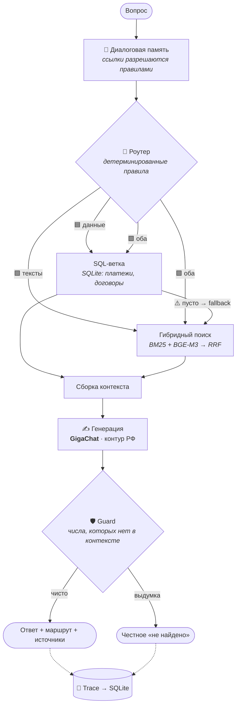

<div align="center">

# ⚖️ LegalRent Copilot

**AI platform for legal rental management on its own hybrid RAG: contract and payment chat, counterparty amendment evaluation with reference to the Russian Civil Code, utility bill calculation, contract completion using a passport photo**

*Hybrid contract corpus search – lexical and vector, with ranking merging. Deterministic code makes judgments based on explicit rules; LLM extracts facts and formulates text. Any question can be verified in 15 seconds*


-21A038)


[Что это делает](#-что-это-делает) · [Возможности](#-шесть-вкладок--шесть-задач-арендодателя) · [Как устроено](#-как-это-устроено-внутри) · [Данные и 152-ФЗ](#-данные-и-соответствие-152-фз) · [Метрики](#-метрики) · [Старт](#-быстрый-старт)

[Read in English](README.en.md)

<br>

<!-- ▶ GIF #1 — ГЛАВНЫЙ. Полный цикл за 60 сек:
     загрузка договора в «Базу знаний» → подтверждение метаданных → индексация
     → переход в «Чат» → вопрос по этому документу → ответ с бейджем маршрута
     → раскрытие источников. Ширина 720px, без звука, 15–20 fps. -->
<!--  -->

<sub>Полный цикл: новый договор → индексация → вопрос → ответ с источниками</sub>

</div>

---

## 🎯 Что это делает

Управление арендой — это один и тот же повторяющийся цикл ручной работы. Платформа закрывает его целиком

| Задача арендодателя | Как обычно | С LegalRent Copilot |
|---|---|---|
| «Какая пеня в договоре с Петросяном?» | Найти файл, листать 40 страниц | Вопрос в чате → ответ за секунды **с фрагментом-источником** |
| «Кто не оплатил за май?» | Свести переписку, Excel и память | Один вопрос → ответ по журналу платежей |
| Контрагент прислал правки | 30–40 минут вычитки, риск пропустить подмену | Вердикт 🟢🟡🟠🔴 по каждой правке **со ссылкой на статью ГК РФ** |
| Квитанции по показаниям счётчиков | Считать в уме или в Excel → перенести в Word → следить, чтобы совпало | Три цифры на арендатора → все квитанции за месяц одним docx |
| Новый договор с арендатором | Перепечатывание паспорта, опечатки в ИНН | Фото паспорта → заполненный договор, **реквизиты проверены контрольными цифрами** |


> **Всё это работает поверх одного механизма: RAG и гибридного поиска по всему спектру различных документов. Лексическая ветка находит точные совпадения — фамилию, номер статьи, номер договора; векторная ветка понимает переформулировки, когда вы спрашиваете «штраф за просрочку», а в документе написано «пеня за нарушение сроков внесения арендной платы». Результаты объединяются в единое ранжирование. Каждый ответ несёт маршрут решения, сработавшее правило, найденные фрагменты с релевантностью и версию правил оценки. Для юридической работы это надёжнее любого обещания «модель не ошибается»**

---

## 🗂 Шесть вкладок — шесть задач арендодателя

<div align="center">

<!-- ▶ GIF #2 — обзор интерфейса. Медленный проход по боковой навигации
     с задержкой ~1.5 сек на каждой вкладке. Ширина 640px. -->
 

</div>

| Вкладка | Задача | Ключевое решение |
|---|---|---|
| 💬 **Чат** | Вопросы к договорам и платежам | Роутер по правилам сам выбирает: таблицы, документы или оба источника |
| ⚖️ **Оценка договоров** | Проверка правок контрагента | Вердикт выносит **код по playbook**, не нейросеть |
| 🧾 **Квитанции** | Расчёт и оформление коммунальных начислений | Деньги считает **только код** — LLM не участвует вовсе |
| 📄 **Заполнение договора** | Договор из карточки и фото паспорта | Реквизиты валидируются контрольными цифрами |
| 🗄️ **База знаний** | Пополнение корпуса | Человек подтверждает метаданные **до** индексации |
| 📈 **Метрики** | Доказательства качества | Eval на реальных данных, здоровье индекса, маршруты |

---

### 💬 Чат — окно ко всей базе

**Зачем.** Один интерфейс вместо «поискать в папке» плюс «свериться с таблицей». Система сама определяет, идёт ли вопрос о данных или о текстах.

**Как это выглядит:**

- **Размышления вслух** — лента шагов человеческим языком: *«📊 Это вопрос о данных — иду в таблицы»*, ниже серым техника: сработавшее правило и релевантность.
- **Fallback как история, а не молчание:** *«📊 иду в таблицы → ⚠️ пусто → 📄 нашёл в акте»*. Система не сдаётся на первой пустой ветке — и показывает это.
- **Бейдж маршрута** у ответа: `🟦 SQL · 1.2с · GigaChat`.
- **Источники** раскрываются; для комбинированных ответов раздельно «Из таблиц» / «Из документов».
- **Диалоговая память.** *«Какая пеня у Петросяна?» → «А срок аренды у него?»* — контекст держится, бейдж «контекст: Петросян» виден, кнопка «🔄 Новая тема» сбрасывает. Разрешение ссылок — **правилами, без обращения к модели**.

<!-- ▶ GIF #3 — чат. Сценарий: вопрос про платежи (ветка SQL) → вопрос по договору
     (ветка RAG с раскрытием источников) → уточняющий вопрос «а у него?»
     с бейджем контекста. Обязательно захватить ленту размышлений. Ширина 720px. -->


---

### ⚖️ Оценка договоров — витрина платформы

**Зачем.** Правки контрагента — самое рискованное место арендных отношений. Подмена «капитальный ремонт за арендодателем» (ст. 616 ГК РФ) или снижение пени 0.1% → 0.01% легко пропустить глазами на десятой странице.

**Как.** Конвейер, где оценку выносит код:

```
файл с правками → alignment (tracked changes) → классификация правки
→ retrieve эталона и норм ГК → извлечение параметров
→ СРАВНЕНИЕ КОДОМ по playbook.yaml → вердикт 🟢🟡🟠🔴 + контраргумент + ссылка на статью
```

- **`playbook.yaml` — 9 категорий правок и 2 красные линии**, написанные практикующим юристом. Не сгенерированы, не заимствованы.
- Каждый вердикт несёт версию playbook — видно, по какой редакции правил получена оценка.
- Правка вне параметрической модели → честный жёлтый «вне модели», **а не молчание**.
- 📎 [Демонстрационный фрагмент playbook (2 категории из 9)](docs/playbook-sample.yaml) — формат правил: пороги, вердикты, ссылки на ГК РФ.

<!-- ▶ GIF #4 — redline. Загрузка договора с правками → появление вердиктов
     с цветовыми маркерами → раскрытие одного 🔴 с контраргументом
     и ссылкой на ст. 616 ГК РФ. Лучший продающий кадр после главного. -->


---

### 🧾 Квитанции — самая частая рутина

**Зачем.** Ежемесячно на каждого арендатора повторяется один цикл: показания счётчиков → расчёт → квитанция. Модуль убирает ручной пересчёт и расхождения между «посчитал в Excel» и «что ушло в Word».

**Как.** По каждому арендатору вводятся три цифры: свет (кВт), вода (м³) и готовая сумма за отопление. Сверху — месяц, год и тарифы (₽/кВт, ₽/м³); отдельно хранится постоянная часть: плательщик, помещение, площадь, фиксированные общие расходы (при необходимости изменяется).

Всю арифметику выполняет детерминированный код в одном месте:

```
свет      = round(кВт × тариф)          610 × 13.8 = 8 418 ₽
вода      = round(м³ × тариф)             3 × 62   =   186 ₽
отопление = переносится как есть                      1 200 ₽
общие     = фиксированная часть                         715 ₽
                                        ─────────────────────
                                        К оплате   10 519 ₽
```

Одну и ту же функцию расчёта вызывают и предпросмотр на экране, и генератор документа — цифры в превью и в Word совпадают по построению, а не по совпадению. На выходе один .docx со всеми квитанциями за месяц.


> **LLM в этом модуле не участвует ни на одном шаге.** Считать деньги доверено только коду: результат воспроизводим, проверяем и не зависит от температуры модели.

---

### 📄 Заполнение договора — фото вместо перепечатывания

**Зачем.** Паспортные данные и реквизиты — главный источник опечаток в договорах.

**Как.** Карточка реквизитов (docx) + фото паспорта → один вызов зрительной модели → поля договора. Затем детерминированная защита: **ИНН, ОГРН и БИК проверяются контрольными цифрами** — правдоподобный, но неверный номер не пройдёт. Готовый договор попадает в папку индексатора и **возвращается в базу знаний**: по нему сразу можно спрашивать в чате.


> **О модели для паспорта — честно.** Целевая архитектура — локальный **Qwen3-VL**, чтобы фото документа не покидало машину. Сейчас идёт подбор локальной модели, дающей приемлемое качество распознавания: протестированная сборка порог пока не проходит (тест помечен `xfail`). До закрытия этого вопроса боевой путь распознавания использует `claude-sonnet-4-6` — **исключительно на тестовых образцах, не на реальных паспортах**. Подробнее в разделе [«Данные и 152-ФЗ»](#-данные-и-соответствие-152-фз).

---

### 🗄️ База знаний — единственная дверь в индекс

**Зачем.** Ошибка в метаданных на входе размножается по всем будущим ответам. Поэтому запись возможна только здесь и только через подтверждение человеком.

**Как.** Загрузка файлов → `scan()` по хэшу: **новый / изменённый / дубликат** → таблица предпросмотра → правка метаданных **до** индексации (низкая уверенность подсвечена; статус документа фиксируется как `verified` / `auto` / `needs_review`) → индексация с прогрессом → проверка целостности → «✓ 3 документа, 47 чанков».

Изменённый документ переиндексируется **целиком** — чанки не живут отдельной жизнью от документа. Неподдерживаемые форматы не пропадают молча: *«3 файла .doc — конвертируйте»*.

<!-- ▶ GIF #5 — база знаний. Загрузка нескольких файлов → таблица
     новый/изменённый/дубликат → правка арендатора в редакторе метаданных
     → индексация с прогрессом → уведомление о результате. -->
<!--  -->

---

### 📈 Метрики — вкладка, отвечающая на «а чем докажете?»

Eval по каждому модулю (реальные примеры строго отдельно от синтетических), здоровье индекса, распределение маршрутов и частота fallback — метрика вида *«12% запросов спасены fallback-логикой»*.

---

## 🧠 Как устроен Гибридный RAG



### Архитектурная подпись

> **LLM извлекает факты и формулирует текст. Суждения выносит детерминированный код по явным правилам.**

| Где | LLM делает | Код делает |
|---|---|---|
| Оценка договоров | извлекает параметры, формулирует текст | **сравнивает по playbook и выносит вердикт** |
| Квитанции | читает показания | **пересчитывает арифметику** |
| Заполнение | читает паспорт | **валидирует ИНН/ОГРН/БИК контрольными цифрами** |
| Маршрутизация | — | **правила** |
| Диалоговая память | — | **правила разрешения ссылок** |

Модель не может «выдумать» оценку правки или сумму платежа — эти решения ей не делегированы. Это же свойство делает систему объяснимой: любое суждение прослеживается до конкретного правила.

📖 **Подробное устройство** — гибридный поиск и RRF, роутер, конвейер индексации, схема трассировки, пирамида тестов, обоснование отказа от LangGraph и OCR: **[ARCHITECTURE.md](ARCHITECTURE.md)**

---

## 🔒 Данные и соответствие 152-ФЗ

Платформа работает с персональными данными арендаторов и чувствительными условиями договоров. Отсюда два принципа.

**Первый: хранение и поиск — полностью локальные, без исключений.** База документов (SQLite), векторный индекс (ChromaDB), лексический индекс (BM25) и модель эмбеддингов (BGE-M3) работают на вашей машине. Содержимое корпуса никуда не передаётся — наружу уходит только текст конкретного запроса с найденным контекстом, и только на этапе формулировки ответа.

**Второй: GigaChat — осознанный выбор, а не компромисс.** Генерация ответов выполняется через GigaChat (Сбер) по двум причинам сразу: обработка остаётся в юрисдикции РФ, что критично для 152-ФЗ, и качество формулировок на русском юридическом языке оказалось достаточным по результатам оценки. Зарубежные API для боевой работы с реальными данными не используются.

### Текущее состояние контуров — без прикрас

| Компонент | Где выполняется сейчас | Целевое состояние |
|---|---|---|
| Хранение, индекс, эмбеддинги, поиск | 🖥 **Локально** | без изменений |
| Маршрутизация, диалоговая память, валидаторы, вердикты redline | 🖥 **Локально** (код, без моделей) | без изменений |
| Извлечение сущностей из документов | 🖥 Локально (Qwen3) | без изменений |
| Генерация ответов и формулировок | 🇷🇺 **GigaChat, контур РФ** | + режим полностью локальной генерации |
| Распознавание паспорта (VLM) | 🌐 `claude-sonnet-4-6`, **только тестовые образцы** | 🖥 локальный VLM, подбор модели идёт |

**Что это значит на практике.** Ядро — поиск, маршрутизация, все детерминированные суждения, весь корпус документов — уже локально. Генерация — в контуре РФ. Единственный участок за пределами контура, распознавание паспорта, **не применяется к реальным документам**: работа идёт на тестовых образцах, пока подбирается локальная модель нужного качества. Полностью офлайн-режим — заявленная цель архитектуры, а не текущее состояние; ограничения перечислены в [ARCHITECTURE.md](ARCHITECTURE.md#контуры-и-ограничения).

**Аудит каждого ответа.** Каждое обращение получает `trace_id`; в SQLite фиксируется маршрут, использованные фрагменты с релевантностью, сработавшие правила, модель и версия playbook. Воспроизводимость для комплаенса обеспечена на уровне архитектуры, а не обещаний.

---

## 📊 Метрики на малом объеме данных

Философия оценки: **ядро — только реальные данные** из живой практики. Синтетика в основную метрику не допускается; при необходимости — отдельным файлом и отдельной строкой отчёта.

| Метрика | Значение |
|---|---|
| Полнота поиска R@10 | **0.935** |
| Регрессионный набор | **10/10** |
| Роутинг, золотой датасет | **21/21** |
| Стресс-тесты guard'а | **≥10/12** (ловит выдумку, не тревожит на честном ответе) |
| Автотесты | **324** — 241 unit · 62 integration · 21 e2e |
| Категорий в playbook | **9** + 2 красные линии |

**Корпус в работе:** 401 документ · 2 299 фрагментов в векторном индексе · 581 запись о платежах. Статусы документов: 267 подтверждённых человеком, 108 автоматических, 26 требуют проверки.

Каждый замер сохраняется с датой, git-хэшем, версией playbook и отпечатком базы — сравнение «до/после» честно только на идентичных данных.

---

## 🚀 Быстрый старт

```bash
git clone https://github.com/<you>/legalrent && cd legalrent
pip install -e .

# локальные компоненты: Ollama с qwen3 и bge-m3
# генерация: GIGACHAT_API_KEY в .env

# индексация: сначала посмотреть, что будет сделано
python -m rag_core.indexer --dry-run ./data/incoming
python -m rag_core.indexer --apply   ./data/incoming

streamlit run app/main.py
```

Программный доступ — фасад из четырёх функций:

```python
from rag_core import ask, retrieve, index, health

answer = ask("какая пеня в договоре с Петросяном?")
answer.route      # ветка, сработавшее правило, триггер
answer.chunks     # источники с релевантностью
answer.trace_id   # полный след в SQLite
```

<details>
<summary>📁 Структура репозитория</summary>

```
legalrent/
├── app/                 # Streamlit: chat, redline, receipts,
│   │                    #   contract_fill, knowledge, eval_dashboard
│   └── ui.py            # единый UI-kit: иконки, бейджи, конвенции
├── src/
│   ├── rag_core/        # движок: router, retrieval, orchestrator,
│   │                    #   indexer, dialogue, sql_branch (наружу — фасад)
│   ├── redline/         # playbook.yaml + конвейер оценки правок
│   ├── receipts/        # parser → renderer → ledger
│   ├── contract_fill/   # VLM + валидаторы контрольных цифр
│   ├── extraction/      # Pydantic-схемы, извлечение
│   └── common/          # tracing, audit
├── evals/               # датасеты и замеры
├── tests/               # unit / integration / e2e
└── docs/                # ARCHITECTURE.md, аудит, изображения
```

</details>

---

## 🧭 Статус

| Компонент | Состояние |
|---|---|
| Ядро RAG: поиск, роутер, SQL-ветка, indexer, health | ✅ работает, покрыто тестами |
| Диалоговая память | ✅ работает |
| Валидаторы реквизитов (контрольные цифры) | ✅ работает |
| Redline: playbook на 9 категорий, ядро вердикта | ✅ работает |
| Квитанции: расчёт → предпросмотр → docx | ✅ работает |
| Квитанции: запись в журнал платежей | 🔨 в работе |
| Заполнение договора: подбор локального VLM | 🔨 в работе |
| UI: чат, база знаний, метрики | 🔨 в работе |
| Полностью офлайн-режим генерации | 🔜 |

Проект развивается по [дорожной карте](ARCHITECTURE.md#дорожная-карта); результаты внутреннего аудита кодовой базы — в `docs/`.

**Осознанно не используется:** OCR-стек (входы текстовые, паспорт — один вызов VLM) · LangGraph и CrewAI (диспетчеризация решается ~50 строками Python) · микросервисы · CSS-хаки поверх Streamlit. Проверочный вопрос к каждому инструменту: *«какую конкретную проблему он решает и решается ли она 50 строками Python?»* — обоснования в [ARCHITECTURE.md](ARCHITECTURE.md#что-осознанно-не-используется).

---

---

## 📦 О доступе к коду

Это публичная витрина проекта: документация, архитектурные решения и метрики.
Исходный код, полный playbook и датасеты в открытый доступ не выкладываются —
они построены на реальных договорах и платёжных данных, работа с которыми
регулируется 152-ФЗ.

Код может быть предоставлен для ознакомления по запросу — в рамках
технической оценки или обсуждения сотрудничества.
Напишите: [ovm26rus@yandex.ru]


## 👤 Автор

Проект на стыке двух практик: **15 лет юридической работы с арендными отношениями + LLM-инженерия**. Playbook оценки договоров, категории правок и eval-датасеты собраны из реальной практики, а не сгенерированы — это и определяет ценность системы.

© 2026 · Все права защищены ·  [English version](README.en.md)

<sub>Демонстрационные материалы подготовлены на обезличенных данных.</sub>
